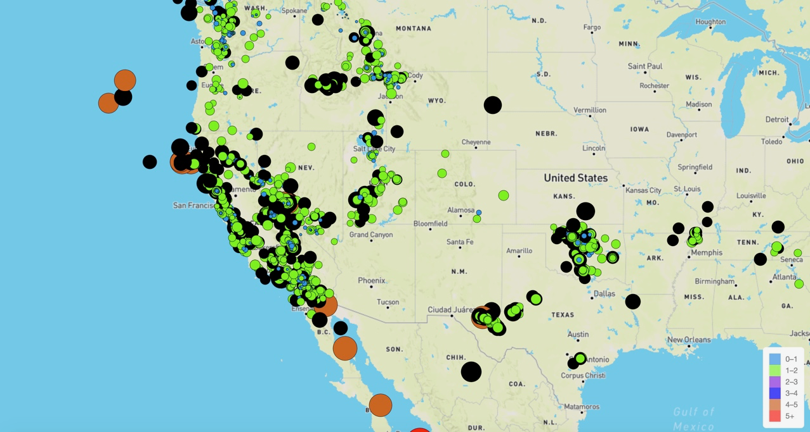

# leaflet-challenge

Welcome to the United States Geological Survey, or USGS for short! The USGS is responsible for providing scientific data about natural hazards, the health of our ecosystems and environment; and the impacts of climate and land-use change. Their scientists develop new methods and tools to supply timely, relevant, and useful information about the Earth and its processes. As a new hire, I will be helping them out with a new project.

The USGS provides earthquake data in a number of different formats, updated every 5 minutes. I visited the USGS's GeoJSON feed and picked a dataset that shows every recorded earthquake that happens in a given week. The JSON info is pulled from the site listed below:

USGS Website:
https://earthquake.usgs.gov/earthquakes/feed/v1.0/summary/all_month.geojson 

I created a map using Leaflet that plots all earthquakes from my dataset based on each earthquake's longitude and latitude.

Each data marker reflects the magnitude of the earthquake by size and location.

